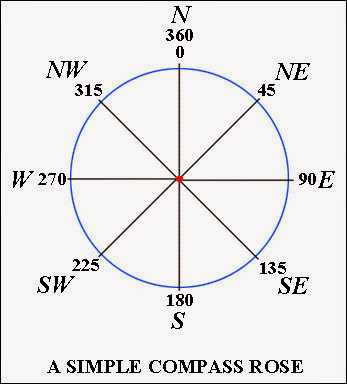

## Overview

**/app** - main API and interception algorithm code

**/test** - pytest unit tests

**/mock** - mock radar data generator and sender for testing and demonstration

**/plots** - where plots are saved (if saving as html is enabled), bind directory for docker

## Setup

### Run using Docker/Podman Compose

Launch main app

```
docker compose run app
podman-compose run app
```

Run radar mock (prints responses to generated radar data, generates plots)

```
docker compose run mock
```

Run unit tests

```
docker compose run unit_tests
```

### Dev setup 

```
python3 -m venv venv

source venv/bin/activate

pip install -r requirements.txt

fastapi dev app/main.py
```

Run mock radar:

```
python mock/radar_mock.py
```

Run tests:

```
pytest
```


## Code and info sources

https://fastapi.tiangolo.com/tutorial/sql-databases/#create-models
https://sqlmodel.tiangolo.com/tutorial/fastapi/tests/#add-the-rest-of-the-tests
https://geopy.readthedocs.io/en/latest/
https://gis.stackexchange.com/questions/425452/calculate-distance-between-two-lat-lon-alt-points-in-python
https://forest.moscowfsl.wsu.edu/fswepp/rc/kmlatcon.html
https://plotly.com/python/getting-started/
https://plotly.com/python/scatter-plots-on-maps/
https://plotly.com/python-api-reference/generated/plotly.graph_objects.Scattergeo.html
https://plotly.com/python/map-configuration/
https://geopy.readthedocs.io/en/latest/index.html#geopy.distance.Distance.destination
https://stackoverflow.com/questions/7477003/calculating-new-longitude-latitude-from-old-n-meters


## TODO/ideas

* Dockerize development
* Improve plots (make it easier to see different response options)
* Test error handling (invalid inputs)
* Test radar_mock
* Different options for running mock, tests etc on docker run (env vars or pass args to radar_mock)
* Improve README
* Make sure VSCode debugger works
* Which api endpoints are needed 
* floats with single precision
* Error handling
* More tests
* Animations?
* Prioritising algorithm to make quicker decisions if target is high danger (fast)
* Triage algorithm 
    * Speed
    * Heading direction (towards/away)
* Fetch data from database only on start


## Tradeoffs, limitations, assumptions in calculations

* Ignore gravity etc
* Assume velocities and threat altitude are constant
* The system has to respond immediately - we cannot wait for a target to move closer into range since a new radar signal is received each second, and the system does not support concurrently dealing with threats and listening for new ones. Therefore some threats which are out of range at first but would be in range a few seconds later are dismissed as unactionable.


## Notes

Heading direction is the angle between the observer’s current position and the target location, measured clockwise from North. It is often expressed in:

Degrees: 0° = North, 90° = East, 180° = South, 270° = West, and values in between (e.g., 45° = Northeast).

https://outdoorquest.blogspot.com/2015/07/compass-navigation-bearing-and-heading.html